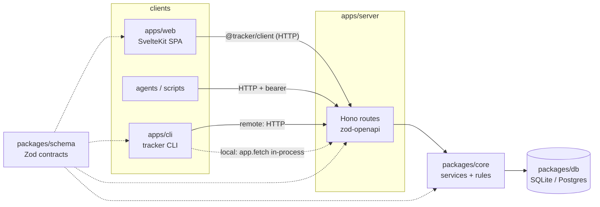

# Architecture

## Layers

| Package      | Responsibility                                                                                   | Must not                                                                            |
| ------------ | ------------------------------------------------------------------------------------------------ | ----------------------------------------------------------------------------------- |
| `schema`     | Isomorphic Zod schemas, the field registry, `IssueFilter`, view config, event and error catalogs | import Node, database or server code                                                |
| `db`         | Dialect factory, migrations, `withWriteTx`, value codecs                                         | contain business rules                                                              |
| `core`       | All business rules: validation, permissions, numbering, ranks, events                            | know about HTTP                                                                     |
| `server`     | HTTP transport: auth, problem+json, ETags, idempotency, OpenAPI                                  | contain business rules                                                              |
| `client`     | Typed HTTP client generated from `docs/openapi.json`                                             |                                                                                     |
| `cli`, `web` | User interfaces over `client`                                                                    | talk to the database directly (the CLI's local mode still goes through `app.fetch`) |

## Request lifecycle

1. **Request context.** `requestId` middleware assigns `X-Request-Id`.
2. **Authentication.** `authenticate` resolves the actor (bearer token, session cookie, or the trusted local actor) and builds a `ServiceContext { db, actor, clock, ids, requestId }`.
3. **Idempotency.** For POSTs with `Idempotency-Key`, the `idempotency` middleware claims the key or replays the stored response.
4. **Validation.** The route validates input with Zod (`defaultHook` → problem+json) and calls a core service.
5. **Write transaction.** The service runs in `withWriteTx` ([ADR 0003](adr/0003-write-transactions.md)). It validates and resolves refs, writes, and appends an event, all in one transaction.
6. **Publication.** After commit, consumers pick up the event from the `events` table ([ADR 0004](adr/0004-event-log-bus-and-outbox.md)).

## Background work

Each server process also runs two loops over the event log:

- **The event tailer** feeds live SSE streams. It is woken by local commits and Postgres `NOTIFY`, with a poll as a fallback ([events.md](events.md)).
- **The webhook runner** fans events out to deliveries and sends them with retries ([ADR 0013](adr/0013-webhook-delivery.md)).

Neither holds in-memory state that matters. Restart any replica at any time; `SIGTERM` drains it gracefully ([deployment.md](deployment.md#health-logs-and-shutdown)).

## Where to look

- Data model: [data-model.md](data-model.md)
- API conventions: [api.md](api.md)
- Decisions: [adr/](adr/)
- Running it: [deployment.md](deployment.md), [security.md](security.md)
- Recipes for changes: [extending.md](extending.md)
