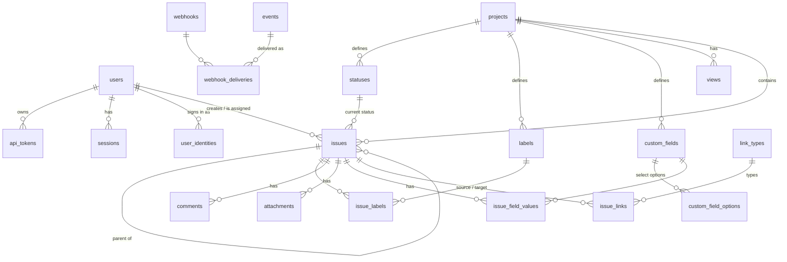

# Data model

The schema is defined once in `packages/db/src/migrations/` and typed in `packages/db/src/types.ts`. For how values are stored on each dialect, see [ADR 0002](adr/0002-dual-dialect-kysely.md).

## Entity relationships

## Tables

| Table                                   | Purpose and key invariants                                                                                                                                                                                                                                                                                                                                                                                                                     |
| --------------------------------------- | ---------------------------------------------------------------------------------------------------------------------------------------------------------------------------------------------------------------------------------------------------------------------------------------------------------------------------------------------------------------------------------------------------------------------------------------------- |
| `users`                                 | Actors: `kind` is `human`, `agent` or `system`; `role` is `admin` or `member`. `handle` is unique and stored lowercase. Users are deactivated, never deleted.                                                                                                                                                                                                                                                                                  |
| `api_tokens`                            | Bearer tokens (`trk_…`). Only the sha256 `token_hash` is stored, plus a display `prefix`. The plaintext is shown once.                                                                                                                                                                                                                                                                                                                         |
| `sessions`                              | Web cookie sessions. The id is the sha256 of the cookie value.                                                                                                                                                                                                                                                                                                                                                                                 |
| `user_identities`                       | External SSO identities (issuer + subject) linked to a user. Rows cascade with the user.                                                                                                                                                                                                                                                                                                                                                       |
| `projects`                              | Top-level container. `key` (e.g. `ENG`) is unique and immutable, so issue keys like `ENG-42` never change. `next_issue_number` is incremented inside the write transaction.                                                                                                                                                                                                                                                                    |
| `statuses`                              | Per-project workflow states. `category` drives semantics (`backlog`, `unstarted`, `started`, `completed`, `canceled`) and `position` orders board columns. Names are unique per project, case-insensitively.                                                                                                                                                                                                                                   |
| `labels`                                | Per-project labels. Names are unique per project, case-insensitively.                                                                                                                                                                                                                                                                                                                                                                          |
| `issues`                                | Identified by `(project_id, number)`. The fields: <ul><li>`priority`: 0 none, 1 urgent … 4 low.</li><li>`rank`: a fractional index, ordered byte-wise.</li><li>`version`: incremented on every change, for optimistic concurrency.</li><li>`metadata`: free-form JSON for integrations and agents.</li><li>`started_at` / `completed_at` / `canceled_at`: follow the status category.</li><li>`deleted_at`: soft delete (the trash).</li></ul> |
| `issue_labels`                          | Many-to-many join between issues and labels.                                                                                                                                                                                                                                                                                                                                                                                                   |
| `comments`                              | Markdown comments. Soft-deletable. `parent_comment_id` is reserved for threads.                                                                                                                                                                                                                                                                                                                                                                |
| `link_types`                            | Link semantics with outward/inward labels, e.g. `blocks` / `is blocked by`. A symmetric type (`relates`) reads the same both ways.                                                                                                                                                                                                                                                                                                             |
| `issue_links`                           | A typed relation between two issues. Unique per `(type, source, target)`; no self links. Symmetric links are stored with `source_id < target_id`.                                                                                                                                                                                                                                                                                              |
| `custom_fields`, `custom_field_options` | Typed per-project fields: text, number, date, boolean, select, multi_select, user, url. Options have stable ids, so relabeling is safe.                                                                                                                                                                                                                                                                                                        |
| `issue_field_values`                    | EAV values in typed columns (`v_text`, `v_number`, …) so filtering stays portable SQL. Single-valued fields get one row per issue; multi-select gets one row per chosen option. Partial unique indexes enforce both.                                                                                                                                                                                                                           |
| `attachments`                           | File metadata. Bytes live in the blob store under a random `storage_key`.                                                                                                                                                                                                                                                                                                                                                                      |
| `views`                                 | Saved list and board configurations (a versioned JSON `config`). `owner_id` null means the view is shared with the project.                                                                                                                                                                                                                                                                                                                    |
| `events`                                | The append-only event log. `seq` is strictly increasing in commit order (values from rolled-back transactions are skipped) ([ADR 0003](adr/0003-write-transactions.md)). `data` holds the resource snapshot plus `changes`. It feeds activity history, SSE, webhooks and agent polling.                                                                                                                                                        |
| `webhooks`, `webhook_deliveries`        | Subscriptions, plus one delivery row per (webhook, event) that tracks retries.                                                                                                                                                                                                                                                                                                                                                                 |
| `idempotency_keys`                      | Stored responses for `Idempotency-Key` retries, keyed by actor, for 24 hours.                                                                                                                                                                                                                                                                                                                                                                  |
| `system_state`                          | Small key/value state, such as the webhook dispatcher cursor.                                                                                                                                                                                                                                                                                                                                                                                  |
